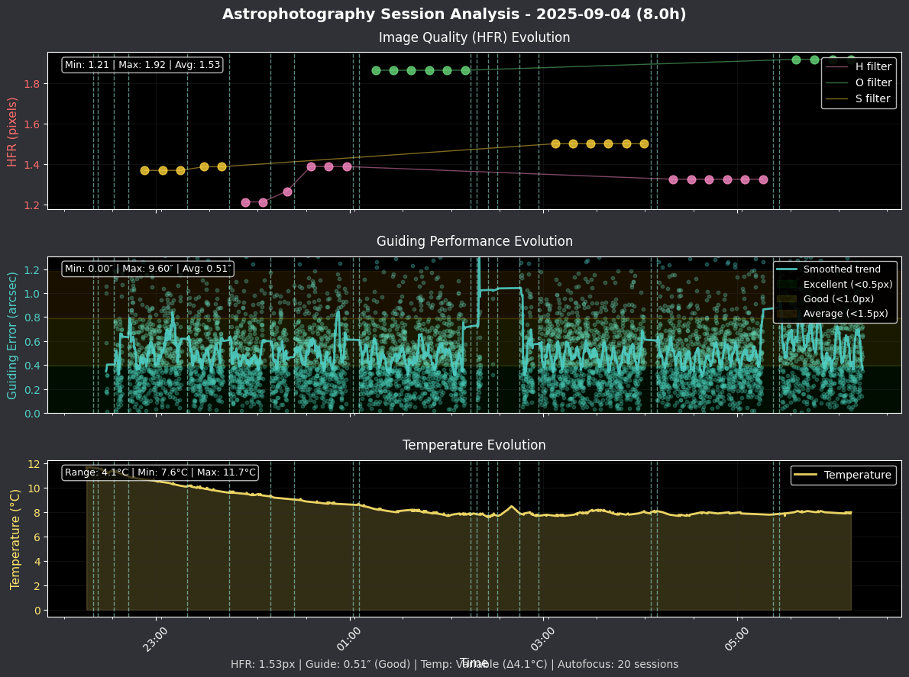

# Ekos Session Analyzer

Astrophotography session analyzer specialized for **Ekos/KStars**. This application analyzes `.analyze` files generated by Ekos and sends comprehensive summaries with **temporal plots** to Discord.

## 🌟 Features

### Core Features
- **Native Ekos Analysis**: Directly parses KStars/Ekos `.analyze` files
- **Temporal Plotting**: HFR, guiding error, and temperature evolution graphs
- **Advanced Analytics**: Statistical analysis with numpy/scipy (optional)
- **3 Report Levels**: minimal, standard, detailed - from quick notifications to comprehensive analysis
- **Discord Integration**: Rich summaries with emojis and organized statistics
- **Dry-Run Mode**: Safe testing without sending to Discord

### Advanced Features
- **Multi-Filter Analysis**: Performance breakdown by filter with sub-session details
- **Pixel-Scale-Based Guiding Quality**: Accurate guiding assessment based on YOUR specific equipment
- **Guiding Analytics**: Comprehensive guiding performance analysis by filter
- **Quality Metrics**: HFR, FWHM, star detection, and seeing conditions
- **Temperature Correlation**: Statistical analysis of temperature effects on imaging quality
- **Intelligent Message Splitting**: Automatic Discord message fragmentation for large sessions
- **Alert System**: Automatic detection of performance issues and recommendations

## 📊 Report Levels

### 📱 **MINIMAL** - Quick Notifications
```
**🔭 Session Summary (Minimal)**
📸 **33 captures completed**
⏰ Duration: 7h 54m

🌤️ **Session Conditions**
🌡️ Temperature Stability: Moderate (Δ4.1°C)

🎯 **Autofocus Summary**
🔄 Sessions: 20
🌡️ Average Temperature: 9.0°C
📈 Focus Stability: Frequent adjustments
```

### 📊 **STANDARD** - Daily Usage (Default)
```
**🔭 Ekos Session Summary**
📅 2025-09-05 07:11 UTC

🌙 **Session Overview**
📸 Total Captures: 33
⏰ Duration: 22:16 → 06:11 (7h 54m)
🌡️ Temperature: 7.6°C → 11.7°C (avg 8.6°C)
🎯 Objects: 1 | 🔍 Filters: 3 (H, O, S)

🌤️ **Session Conditions**
🌡️ Temperature Stability: Moderate (Δ4.1°C)

🌟 **Guiding Performance**
📊 Measurements: 6130
🎯 Avg Error: 0.51″
🟡 Guide Quality: Good
📈 RA: 0.38″ | DEC: 0.27″

📊 **Capture Details**

🎯 **NGC 7380**
📌 H Filter (12×600s, 2h 18m)
   📈 Guide: 0.49″ 🟡Good
   📋 Sub-sessions: 2
     #1: 23:55→00:58 (1h 12m) | 6×600s
          📈 Guide: 0.50″ 🟡Good
          🔧 HFR: 2.65 → 3.46 (avg 2.97)
          📐 FWHM: 3.18 → 4.15 (avg 3.56)
          ⭐ Stars: 579 → 581 (avg 580, consistency 1.00)
     #2: 04:20→05:15 (1h 5m) | 6×600s
          📈 Guide: 0.48″ 🟡Good
          🔧 HFR: 3.27 → 5.31 (avg 4.27)
          📐 FWHM: 3.92 → 6.38 (avg 5.12)
          ⭐ Stars: 532 → 560 (avg 545, consistency 0.98)

🎯 **Autofocus Summary**
🔄 Sessions: 20
🌡️ Average Temperature: 9.0°C
📈 Focus Stability: Frequent adjustments

⚠️ **Issues & Alerts**
❌ Aborted Captures: 7
```

### 🔬 **DETAILED** - Data Analysis Mode
```
**🔭 Session Overview (1/3)**
📅 2025-09-05 07:32 UTC

🌙 **Session Overview**
📸 Total Captures: 33
⏰ Duration: 22:16 → 06:11 (7h 54m)
🌡️ Temperature: 7.6°C → 11.7°C (avg 8.6°C) (Stability: 0%)
🎯 Objects: 1 | 🔍 Filters: 3 (H, O, S)

🌤️ **Session Conditions**
🌡️ Temperature Stability: Moderate (Δ4.1°C)

🌟 **Guiding Performance**
📊 Measurements: 6130
🎯 Avg Error: 0.51″
🟡 Guide Quality: Good
📈 RA: 0.38″ | DEC: 0.27″

🎯 **Autofocus Summary**
🔄 Sessions: 20
🌡️ Average Temperature: 9.0°C
📈 Focus Stability: Frequent adjustments

📊 **Image Quality Analysis**
🔧 HFR: 1.87 → 5.31 (avg 2.71)
👁️ Seeing Conditions: Good

⚠️ **Issues & Alerts**
❌ Aborted Captures: 7
🚨 High HFR detected: 5.31 pixels (consider refocusing)

**📊 Performance Analysis (2/3)**

🎯 **Filter Performance Summary**

📌 **H**: 12×600s (2.3h) - 🔧 3.62 | 📈 0.49″ 🟡
📌 **O**: 10×600s (1.8h) - 🔧 2.31 | 📈 0.52″ 🟡
📌 **S**: 11×600s (2.1h) - 🔧 2.08 | 📈 0.50″ 🟡

**🔬 Detailed Sub-Sessions (3/3)**

📌 H Filter (12×600s, 2h 18m)
📋 Sub-sessions: 2
     #1: 23:55→00:58 (1h 12m) | 6×600s
          📈 Guide: 0.50″ 🟡Good
          🔧 HFR: 2.65 → 3.46 (avg 2.97)
          📐 FWHM: 3.18 → 4.15 (avg 3.56)
          ⭐ Stars: 579 → 581 (avg 580, consistency 1.00)
     #2: 04:20→05:15 (1h 5m) | 6×600s
          📈 Guide: 0.48″ 🟡Good
          🔧 HFR: 3.27 → 5.31 (avg 4.27)
          📐 FWHM: 3.92 → 6.38 (avg 5.12)
          ⭐ Stars: 532 → 560 (avg 545, consistency 0.98)

📌 S Filter (11×600s, 2h 3m)
📋 Sub-sessions: 2
     #1: 22:53→23:40 (58m) | 5×600s
          📈 Guide: 0.52″ 🟡Good
          🔧 HFR: 1.90 → 2.41 (avg 2.04)
          📐 FWHM: 2.28 → 2.89 (avg 2.44)
          ⭐ Stars: 564 → 571 (avg 568, consistency 1.00)
     #2: 03:07→04:02 (1h 5m) | 6×600s
          📈 Guide: 0.49″ 🟡Good
          🔧 HFR: 2.03 → 2.18 (avg 2.11)
          📐 FWHM: 2.44 → 2.61 (avg 2.53)
          ⭐ Stars: 543 → 569 (avg 556, consistency 0.98)

📌 O Filter (10×600s, 1h 49m)
📋 Sub-sessions: 2
     #1: 01:16→02:11 (1h 5m) | 6×600s
          📈 Guide: 0.47″ 🟡Good
          🔧 HFR: 1.87 → 2.21 (avg 2.05)
          📐 FWHM: 2.25 → 2.65 (avg 2.46)
          ⭐ Stars: 634 → 643 (avg 638, consistency 1.00)
     #2: 05:36→06:10 (44m) | 4×600s
          📈 Guide: 0.60″ 🟡Good
          🔧 HFR: 2.63 → 2.78 (avg 2.69)
          📐 FWHM: 3.16 → 3.34 (avg 3.23)
          ⭐ Stars: 519 → 520 (avg 519, consistency 1.00)

🤖 **Analysis & Recommendations**
🚨 High HFR detected: 5.31 pixels (consider refocusing)
```

## 📋 Requirements

- Python 3.7+
- KStars/Ekos configured to generate analyze files
- Discord webhook configured
- **For DETAILED level**: NumPy/SciPy for advanced analytics
- **For plotting**: matplotlib (optional)

## 🛠️ Prerequisites

### Installing Pipenv

This project uses **Pipenv** for dependency management. If you don't have pipenv installed, here's how to install it:

#### Ubuntu/Debian
```bash
# Method 1: Using apt (recommended for system-wide installation)
sudo apt update
sudo apt install pipenv

# Method 2: Using pip (if you prefer pip)
sudo apt install python3-pip
pip3 install --user pipenv

# Method 3: Using the official installer
curl https://raw.githubusercontent.com/pypa/pipenv/master/get-pipenv.py | python3
```

#### Other Linux Distributions
```bash
# Fedora/CentOS/RHEL
sudo dnf install pipenv
# or
sudo yum install pipenv

# Arch Linux
sudo pacman -S python-pipenv

# Using pip (universal)
pip3 install --user pipenv
```

#### Verify Installation
```bash
pipenv --version
# Should output something like: pipenv, version 2023.x.x
```

**Note for Ubuntu/Debian users**: If you installed pipenv with `pip3 install --user`, you may need to add `~/.local/bin` to your PATH:
```bash
echo 'export PATH="$HOME/.local/bin:$PATH"' >> ~/.bashrc
source ~/.bashrc
```

## 🚀 Installation

1. **Clone the repository**
```bash
git clone https://github.com/grm/ekos-session-analyzer
cd ekos-session-analyzer
```

2. **Install dependencies**
```bash
# Basic installation (minimal & standard levels)
pipenv install

# For detailed level with advanced analytics
pipenv install numpy scipy

# For temporal plots (optional)
pipenv install matplotlib
```

3. **Configure the application**
```bash
# Copy example configuration
cp config_example.yml config.yml

# Edit config.yml with your settings
```

## ⚙️ Configuration

### Basic Configuration

Edit the `config.yml` file:

```yaml
# Discord webhook URL (required)
webhook: "https://discord.com/api/webhooks/YOUR_WEBHOOK_ID/YOUR_WEBHOOK_TOKEN"

# Time window in hours to analyze sessions
hours: 24

# Path to Ekos analyze files (optional)
# Default: ~/.local/share/kstars/analyze
analyze_dir: "/home/username/.local/share/kstars/analyze"

# Report level: minimal, standard, detailed
discord_report_level: "standard"

# Enable temporal plotting (optional)
plotting:
  enabled: true

# Log level (optional)
log_level: "INFO"
```

### 🎯 Pixel Scale Configuration (HIGHLY RECOMMENDED)

**NEW FEATURE**: Configure your equipment's pixel scale for dramatically more accurate guiding quality assessment!

```yaml
# Imaging setup configuration for accurate guiding assessment
imaging_setup:
  # Pixel scale in arcseconds per pixel
  # Calculate as: (206265 × pixel_size_μm) ÷ (focal_length_mm × binning)
  pixel_scale_arcsec: 1.0  # CHANGE THIS to match your setup
  
  # Optional: Equipment names for logging
  telescope: "Your Telescope"
  camera: "Your Camera"

# Guide quality thresholds (in pixels - much more accurate!)
alert_thresholds:
  guide_quality:
    excellent_px: 0.5    # < 0.5 pixels = Excellent
    good_px: 1.0         # < 1.0 pixels = Good  
    average_px: 1.5      # < 1.5 pixels = Average
    # > 1.5 pixels = Poor
```

#### 📏 How to Find Your Pixel Scale

**Method 1: Calculate from Equipment Specs**
```
Pixel Scale = (206.265 × pixel_size_μm) ÷ (focal_length_mm × binning)
```

**Method 2: From Plate Solving Software**
- **ASTAP**: Check image solving results
- **PlateSolve2**: Look in FITS header for CDELT1/CDELT2
- **ANSVR**: Check solving logs or image properties
- **Ekos/KStars**: View solved image properties in the Image tab

**Method 3: Online Calculators**
- Use tools like Astronomy.tools Field of View calculator (https://astronomy.tools/calculators/ccd_suitability)
- Enter telescope focal length and camera pixel size

#### 🔍 Finding Equipment Specifications

**Camera Pixel Size** (common values):
- **ASI183MC/MM**: 2.4μm
- **ASI294MC/MM**: 4.63μm  
- **ASI2600MC/MM**: 3.76μm
- **Canon 6D**: 5.36μm
- **Nikon D750**: 5.95μm
- **QHY600**: 3.76μm

**Telescope Focal Length**:
- Check manufacturer specs or measure via plate solving
- **Celestron C8**: 2032mm (f/10), 1280mm (f/6.3 with reducer)
- **Celestron C11**: 2800mm (f/10), 1764mm (f/6.3 with reducer)  
- **FSQ85**: 450mm
- **FSQ106**: 530mm
- **Takahashi TOA150**: 1095mm

#### 📊 Common Setup Examples

```yaml
# High Resolution Setup
# Celestron C8 f/6.3 (1280mm) + ASI183MC (2.4μm)
pixel_scale_arcsec: 0.39

# Medium Resolution Setup  
# FSQ85 (450mm) + ASI294MC (4.63μm)
pixel_scale_arcsec: 2.12

# Wide Field Setup
# 200mm lens f/2.8 + Canon 6D (5.36μm)
pixel_scale_arcsec: 5.52

# Ultra High Resolution
# C11 f/10 (2800mm) + ASI183MC (2.4μm)
pixel_scale_arcsec: 0.18
```

### Advanced Options (Optional)

```yaml
# Advanced analytics (auto-enabled for detailed level)
advanced_analytics:
  enabled: false  # Set to true to force enable for standard level

# Alert thresholds (optional customization)
alert_thresholds:
  hfr_drift_warning: 0.5        # pixels
  temperature_swing_warning: 5.0 # °C
  success_rate_warning: 0.8     # 80%

# Notification preferences
notifications:
  performance_alerts: true
  min_captures_for_report: 1
```

## 🔧 Usage

### Development and Testing
```bash
# Safe testing with dry-run (RECOMMENDED)
pipenv run python nightly_summary.py -c config.yml --dry-run

# Verbose mode for debugging
pipenv run python nightly_summary.py -c config.yml --dry-run --verbose
```

### Production Use
```bash
# Send summary to Discord
pipenv run python nightly_summary.py -c config.yml

# With verbose output
pipenv run python nightly_summary.py -c config.yml --verbose
```

### Automation
Add to your crontab for daily summary at 8 AM:
```bash
0 8 * * * cd /path/to/ekos-session-analyzer && pipenv run python nightly_summary.py -c config.yml
```

## 📊 Example Output

### Discord Message with Temporal Plot

Here's an example of what gets sent to Discord, including both the comprehensive text summary and temporal visualization from a real NGC 7380 session:



The temporal plot shows:
- **🔧 HFR Evolution**: Focus quality changes over time with autofocus events marked
- **📈 Guiding Performance**: Mount tracking stability with quality zones
- **🌡️ Temperature Evolution**: Environmental conditions during the session

## 🔍 Troubleshooting

### No Data Found
- Verify that KStars/Ekos generates `.analyze` files in `~/.local/share/kstars/analyze/`
- Check the `analyze_dir` path in configuration
- Use `--verbose` to see detailed logs

### Discord Webhook Error
- Verify the webhook URL in `config.yml`
- Test with `--dry-run` first to see formatted output

### Advanced Analytics Issues
- For DETAILED level, install: `pipenv install numpy scipy`
- The system gracefully falls back to basic mode if dependencies are missing
- Check console output for "advanced analytics" vs "basic analytics"

### Plotting Issues
- Install matplotlib: `pipenv install matplotlib`
- Check `plotting.enabled: true` in configuration
- Plots are saved to `plots/` directory and attached to Discord messages

### Parsing Issues
- Check KStars/Ekos version (tested with 3.7.7+)
- Enable verbose mode: `--verbose`
- Use dry-run for safe testing: `--dry-run`

## 🎯 Use Cases

### **Quick Monitoring** → MINIMAL Level
- Essential notifications for automation
- Critical alerts only
- Perfect for mobile notifications and monitoring systems

### **Daily Usage** → STANDARD Level (Default)
- Comprehensive session summaries
- All essential astrophotography metrics
- Balanced information without complexity

### **Data Analysis** → DETAILED Level  
- In-depth statistical analysis with sub-sessions
- Quality and performance optimization insights
- Scientific metrics with correlation analysis
- Advanced troubleshooting information

## 🔬 Advanced Analytics (DETAILED Level)

### Automatic Features
When you select `discord_report_level: "detailed"`, the system automatically enables:

- **Sub-Session Analysis**: Detailed breakdown of each imaging run by filter
- **Statistical Correlations**: Temperature-HFR analysis with significance testing
- **Quality Scoring**: Objective analysis of session quality and conditions
- **Performance Metrics**: Success rates and filter-specific efficiency analysis
- **Trend Analysis**: HFR stability and degradation detection
- **Intelligent Alerts**: Automatic detection of issues with actionable recommendations

### Dependencies
The detailed level requires scientific Python libraries:
```bash
pipenv install numpy scipy
```

## 🧪 Development

### Safe Testing
Always use dry-run mode during development:
```bash
# Test without sending to Discord
pipenv run python nightly_summary.py -c config.yml --dry-run --verbose
```

### Architecture
- **nightly_summary.py**: CLI interface and orchestration
- **ekos_analyzer.py**: Ekos .analyze file parser and data extraction
- **ekos_discord_formatter.py**: Unified Discord message formatter for all levels
- **session_plotter.py**: Temporal plot generation with matplotlib
- **advanced_metrics.py**: Statistical calculations and quality analysis
- **utils.py**: Configuration, logging, and Discord utilities

## 🤝 Contributing

Contributions are welcome! The project uses:
- **Python 3.7+** with Pipenv for dependency management
- **NumPy/SciPy** for advanced analytics (optional)
- **matplotlib** for temporal plotting (optional)
- **Clear separation** between basic and advanced features with graceful degradation

## 📄 License

This project is under MIT license. See LICENSE file for details.

## 🙏 Acknowledgments

- KStars/Ekos team for excellent astrophotography software
- Discord community for feedback and suggestions
- NumPy/SciPy communities for statistical computing tools

## 🚀 Latest Updates

- **🎯 Pixel-Scale-Based Guiding Quality**: Revolutionary improvement in guiding assessment accuracy! Configure your equipment's pixel scale for meaningful quality ratings instead of misleading fixed thresholds.
- **Enhanced Multi-Filter Analysis**: Comprehensive sub-session breakdown by filter
- **Improved Guiding Analytics**: Real-time guiding performance analysis with quality assessment
- **Intelligent Message Splitting**: Automatic Discord message fragmentation for large sessions
- **Temporal Plotting System**: HFR, guiding, and temperature evolution graphs with pixel-scale-accurate quality zones
- **Advanced Statistical Analysis**: Temperature correlations and quality metrics
- **Better Error Handling**: Graceful degradation and clear error messages
- **Unified Configuration**: Single config file supporting all features and levels

Perfect for astrophotographers from beginners to data enthusiasts! 🔭✨
